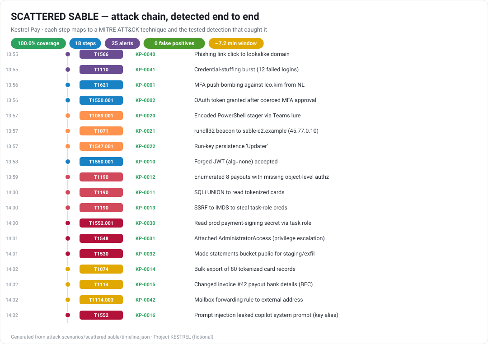

# Project KESTREL — Security Program & Purple-Team Range for a Fictional Fintech

> I designed, built, attacked, defended, monitored, investigated, and measured the security program of a small
> fintech (**Kestrel Pay, Inc.**) — end to end, on a single 8 GB laptop, for **$0** — using a SIEM-less,
> **detection-as-code** architecture. Real telemetry, tested detections, a full incident, and before/after metrics.

    



*The emulated SCATTERED SABLE intrusion — every step mapped to an ATT&CK technique and the tested detection that caught it (generated from real data by `make report`).*

🔗 **Live dashboard:** https://innovaeonlabs.github.io/kestrel-security-program/ · 📊 **Attack-chain visual** above (renders on GitHub)

---

## ⏱️ 30-Second Recruiter View

**What this is:** A complete, evidence-backed security program for a realistic fictional fintech — not a tool tour.
I play the security team of **Kestrel Pay** (a Series-A embedded-payments API startup) and take one financially-motivated
intrusion (**"SCATTERED SABLE"**) all the way through the lifecycle:

**ATTACK → TELEMETRY → DETECTION → INVESTIGATION → RESPONSE → REMEDIATION → RETEST → MEASURED IMPROVEMENT.**

| I built | With (all free/OSS) |
|---|---|
| A vulnerable payments **API + LLM copilot** (prompt injection; real local model via Ollama or mock) | Python / FastAPI |
| A **detection-as-code** pipeline (Sigma rules → SQL, MITRE-mapped, unit-tested) | Sigma, DuckDB, Python |
| **Real endpoint telemetry** from a live Windows host (no VM) | Sysmon + PowerShell logging |
| A **cloud IAM attack-path** analysis + IaC scanning | Terraform, Checkov, Python (networkx) |
| A **CI/CD supply-chain** gate that blocks secrets & vulns pre-deploy | gitleaks, Semgrep, Trivy, pip-audit |
| A full **incident case** + **DFIR timeline** + **executive summary** | Markdown, Python |
| **GRC**: risk register + NIST CSF 2.0 / CIS v8 mapping | Markdown, CSV |

**Standout, measurable outcomes** (computed from real artifacts, not invented — see [`metrics/metrics.json`](metrics/metrics.json)):
- Detection coverage of the emulated intrusion raised from **0% → 100%** (16/16 ATT&CK techniques, 18/18 steps)
- Intrusion detectable at **initial access**, ~**7 minutes before** the first business-impact action (a real containment window)
- **0 false positives** on a 40-event benign baseline; **56 detection unit tests** pass (fires-on-malicious + silent-on-benign)
- **14 findings** triaged → prioritized by exploitability + exposure + asset value + attack-path → **12 remediated** (4 retested with passing tests)
- **7 → 0 identity/cloud attack paths** to the crown jewels after least-privilege; **41 IaC misconfigs** caught by static scanning
- The vulnerable app **actually runs and is exploitable end-to-end** — [live attack transcript](evidence/live-attack/transcript.md) (real IDOR/SQLi/SSRF/prompt-injection responses) whose telemetry the detections then catch
- **Real scanner output committed** ([`devsecops/scan-results/`](devsecops/scan-results/)): gitleaks **14 → 0** after allowlist, bandit **5** SAST findings, pip-audit dependency CVEs **found + remediated to 0** (retested), Checkov **41**

> Architecture diagram: [`docs/architecture/`](docs/architecture/) · One-page exec summary: [`reports/`](reports/)

---

## 🧭 5-Minute Hiring-Manager View

**The company.** Kestrel Pay sells an embedded payments/invoicing **API** to SMB SaaS platforms. ~45 employees,
remote-first on Google Workspace + AWS + GitHub. **Crown jewels:** customer cardholder/bank data, the payment-signing
keys, the production AWS account, and the CI/CD pipeline that ships the API. **Regulatory pressure:** PCI DSS, SOC 2
Type II (customers demand it before signing), state privacy laws. **Threat profile:** financially-motivated eCrime
(identity/social-engineering, SaaS/cloud abuse, API fraud), BEC, credential stuffing, and supply-chain risk.

**The program (this repo).** I model the business and its assets, threat-model the crown jewels, stand up a lightweight
**range** that emits the same telemetry a real stack would, engineer and **test** detections as code, emulate a
realistic multi-stage adversary, run the alert-to-incident-to-recovery loop, **improve** the detections, **automate**
the toil, and **measure** the before/after posture — then translate all of it into **business risk** and executive language.

**Why it's shaped this way (a deliberate tradeoff).** Enterprise SOCs run heavyweight SIEMs. This lab runs on a
2-core / 8 GB laptop, so I built a **SIEM-less, telemetry-as-data** pipeline (Sigma → DuckDB) that is portable,
vendor-neutral, and cheap — and I document the **real-world enterprise equivalent** for every lab shortcut, so the
judgment is visible instead of hidden. See [`docs/architecture/lab-vs-enterprise.md`](docs/architecture/).

**Start here:**
[Executive assessment](reports/) · [Threat model](docs/threat-model/) · [Attack→Defense story](attack-scenarios/) ·
[Detections](detections/) · [Incident report](incident-response/) · [Risk register](docs/risk/) · [Metrics](metrics/)

---

## 🔬 Technical Deep Dive (index)

| Domain | Evidence |
|---|---|
| Architecture (current vs target) | [`docs/architecture/`](docs/architecture/) |
| Threat model (STRIDE + attack trees + ATT&CK) | [`docs/threat-model/`](docs/threat-model/) |
| Asset inventory | [`assets/`](assets/) |
| Vulnerable API + LLM copilot | [`range/kestrel-api/`](range/kestrel-api/) · [`appsec/`](appsec/) |
| Detection-as-code (Sigma + runner + tests) | [`detections/`](detections/) · [`automation/`](automation/) |
| ATT&CK coverage matrix / Navigator layer | [`detections/coverage/`](detections/) |
| Attack scenarios (3: external, insider, supply-chain) | [`attack-scenarios/`](attack-scenarios/) |
| Purple-team report (before/after) | [`purple-team/`](purple-team/) |
| Incident response + DFIR | [`incident-response/`](incident-response/) · [`dfir/`](dfir/) |
| Malware analysis (benign, self-authored sample) | [`dfir/malware-analysis/`](dfir/malware-analysis/analysis.md) |
| Threat intelligence | [`threat-intel/`](threat-intel/) |
| Cloud / IAM security | [`cloud-security/`](cloud-security/) |
| Identity attack-path analysis | [`identity/`](identity/) |
| DevSecOps / supply chain | [`devsecops/`](devsecops/) |
| Vulnerability management lifecycle | [`vulnerability-management/`](vulnerability-management/) |
| Security automation | [`automation/`](automation/) |
| GRC / risk / control mapping | [`docs/risk/`](docs/risk/) |
| Metrics & posture comparison | [`metrics/`](metrics/) |
| Lessons learned / retrospective | [`docs/lessons-learned/`](docs/lessons-learned/) |

### Reproduce it
```bash
# Prereqs: Docker, Python 3.11+, Git. Everything else installs into a local venv.
git clone https://github.com/InnovaeonLabs/kestrel-security-program.git && cd kestrel-security-program
python -m venv .venv && . .venv/Scripts/activate    # (Linux/macOS: source .venv/bin/activate)
pip install -r requirements.txt
make run-app           # runs the REAL vulnerable app at http://127.0.0.1:8080 (no Docker needed)
make live-attack       # drives the running app over HTTP → real vulnerable responses + telemetry
make emulate SCENARIO=scattered-sable   # (alt) benign, self-cleaning adversary chain via telemetry
make detect            # compiles + runs Sigma detections over collected telemetry
make scan              # runs bandit / detect-secrets / pip-audit locally
make report            # regenerates metrics + dashboards + attack-chain SVG from evidence
```

> **Safety & scope.** All offensive activity is benign, reversible, and confined to this lab (containers + a scoped
> local folder). No live malware, no third-party targets. See [`SECURITY.md`](SECURITY.md) and each scenario's scope note.

---
*Independent portfolio project. "Kestrel Pay" is a fictional company; any resemblance to real entities is coincidental.*
