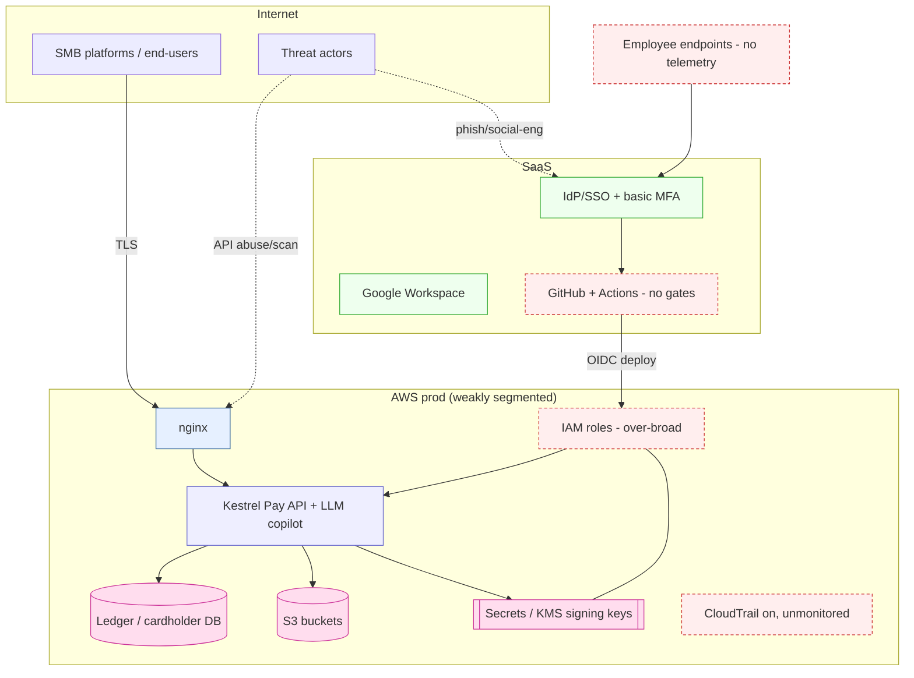

# Security Architecture — Current / Initial State

This is the **"before"** picture: the environment as Kestrel Pay runs it today, with minimal security engineering.
The target/improved state is in [`target-state.md`](target-state.md) (built out in Phase 12) and the delta is what the
whole project delivers.

## Current-state diagram

## Current-state gaps (the problem statement, in one place)
| # | Gap | Consequence | Fixed in phase |
|---|-----|-------------|----------------|
| G1 | **No centralized telemetry / detections** | Attacks are invisible; no IR possible | 3, 7 |
| G2 | **No endpoint visibility** | Token theft / LotL undetected | 3, 7 |
| G3 | **Over-broad cloud IAM, unmonitored CloudTrail** | Priv-esc & data access unnoticed | 6, 7 |
| G4 | **No CI/CD security gates** | Secrets & vulns ship to prod | 5, 6 |
| G5 | **API authz/validation weaknesses** | IDOR/SQLi/SSRF → data & money | 5, 6 |
| G6 | **Basic MFA, no identity detection** | Account takeover is easy & silent | 6, 7 |
| G7 | **Secrets in code/history, no access alerting** | Signing keys reachable | 5, 6, 7 |
| G8 | **No IaC/storage scanning** | Public S3 / misconfig risk | 5, 6 |
| G9 | **No vuln-management lifecycle** | Risk unprioritized | 5 |
| G10 | **No GRC linkage** | Can't prove SOC 2 / prioritize by risk | 12 |

## Design constraints (host reality) → architecture stance
The lab host is 2-core / 8 GB. Enterprise SIEM stacks won't run. Stance:
**telemetry is data on disk → queried on demand with DuckDB → detections are code (Sigma) → dashboards are generated
static artifacts.** Rationale, tradeoffs, and the **enterprise equivalent** for each choice are in
[`lab-vs-enterprise.md`](lab-vs-enterprise.md) (Phase 2).
