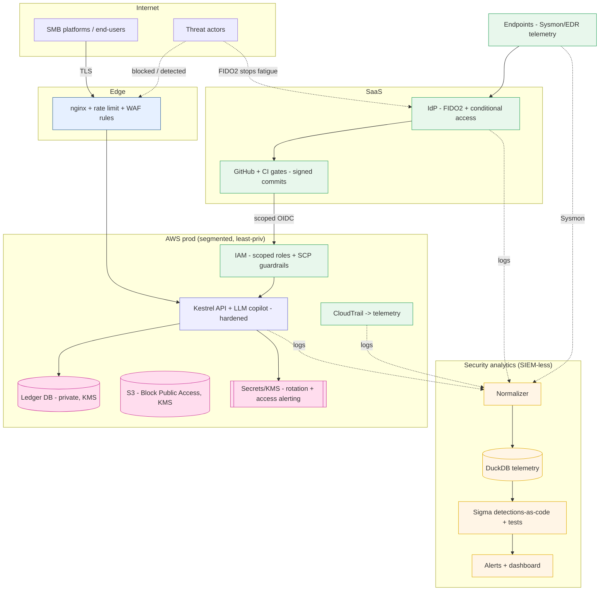

# Security Architecture — Target / Improved State

The **"after"** picture: what Project KESTREL builds toward. Contrast with [`current-state.md`](current-state.md).
The delta is the roadmap; every added control traces to a risk and a piece of evidence.

## Target-state diagram

## Current → Target deltas (each closes a gap)
| Gap (current) | Target control | Evidence | Risk |
|---|---|---|---|
| G1/G2 no telemetry/detection | Normalizer→DuckDB + 15 tested Sigma rules + dashboard | `detections/`, `dashboard/` | R-11,R-12 |
| G3 over-broad cloud IAM | Scoped roles + SCP + CloudTrail detections | `cloud-security/`, KP-0030/31/32 | R-02 |
| G4 no CI gates | gitleaks/Semgrep/Checkov/pip-audit in CI | `.github/workflows/ci.yml` | R-05 |
| G5 API weaknesses | Hardened build (authz/alg/paramz/SSRF/guards) | `appsec/`, `KESTREL_HARDENED` | R-03,R-09 |
| G6 weak identity | FIDO2 + conditional access + identity detections | `identity/`, KP-0001/2 | R-01 |
| G7 secrets exposure | Rotation + access alerting + secret scanning | `cloud-security/`, KP-0030 | R-04 |
| G8 no IaC scan | Checkov (41 findings) + hardened.tf | `cloud-security/` | R-06 |
| G9 no vuln mgmt | Risk-based lifecycle register | `vulnerability-management/` | all |
| G10 no GRC linkage | NIST CSF/CIS/SOC 2 mapping | `docs/risk/control-mapping.md` | R-* |
