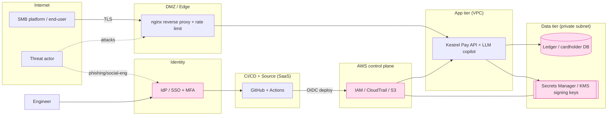

# Kestrel Pay — Threat Model

Methodology: **crown-jewel-first**, combining **STRIDE** (per trust boundary), **attack trees** (per crown jewel), and
**MITRE ATT&CK** mapping (so threats connect directly to the detections in `../../detections/`).

## 1. Trust boundaries & data-flow (current state)

**Boundaries:** Internet↔Edge, Edge↔App, App↔Data, Human↔Identity, Identity↔CI/CD, CI/CD↔Cloud. Each is a place where
authentication, authorization, and validation must hold — and where telemetry must exist.

## 2. STRIDE by boundary (abbreviated — full matrix drives detections)
| Boundary | S | T | R | I | D | E |
|---|---|---|---|---|---|---|
| Internet→Edge/API | Credential stuffing, token forgery | Request tampering, replay | Missing audit logs | IDOR/broken object auth, data scraping | Volumetric / app-layer DoS | Privilege bugs in API |
| Human→Identity | Phishing, MFA fatigue, session-token theft | — | Login logs gaps | Account takeover → data | Lockout abuse | Role over-assignment |
| Identity→CI/CD | Stolen PAT/OIDC | Poisoned pipeline/dep | Unsigned commits | Secret leak in logs | Pipeline outage | Runner→cloud priv-esc |
| CI/CD→Cloud | Over-broad OIDC role | IaC drift/misconfig | CloudTrail gaps | Public S3 / secret exposure | Resource deletion | IAM privilege escalation |
| App→Data | Injection auth bypass | SQLi tampering | DB audit gaps | Cardholder data exfil | DB exhaustion | Grant creep |

## 3. Attack trees (crown jewels)

### Goal A — Move money fraudulently (compromise signing keys / ledger)
```
Move money fraudulently
├── Compromise an engineer/admin identity            [ATT&CK: T1566 Phishing, T1621 MFA fatigue, T1539 session cookie theft]
│   ├── Phish credentials + push-bombing MFA
│   └── Steal session token from endpoint            [T1528, T1550.004]
├── Abuse the API directly
│   ├── Broken object-level auth (IDOR) on payouts    [T1190 exploit public app; OWASP API1]
│   ├── JWT flaws (alg=none / weak secret)            [OWASP API2]
│   └── SSRF → reach internal metadata / secrets      [T1190; OWASP API7]
├── Reach the cloud control plane
│   ├── Stolen OIDC/role → assume broader role        [T1078.004 valid cloud accounts, T1548 priv-esc]
│   └── Read signing key material from Secrets/KMS    [T1552 unsecured credentials]
└── Poison the pipeline
    └── Malicious dependency / commit → prod deploy   [T1195 supply chain, T1554]
```

### Goal B — Steal cardholder/PII at scale
```
Exfiltrate customer data
├── SQL injection in API                             [T1190; OWASP API8]
├── Account takeover → export endpoints              [T1078; API1/API3]
├── Public/misconfigured S3 export bucket            [T1530 data from cloud storage]
└── Insider bulk export                              [T1074 data staged, T1567 exfil to web]
```

### Goal C — Business Email Compromise / invoice fraud
```
Redirect a real payout via BEC
├── Phish finance/ops mailbox                        [T1566]
├── Create mail forwarding / auto-reply rule         [T1114.003 email collection rule]
└── Inject fraudulent bank details into an invoice   [social-eng + API abuse]
```

## 4. Primary attack path chosen for emulation — "SCATTERED SABLE"
A single, coherent, financially-motivated chain that touches the maximum number of crown jewels and disciplines:

**Initial access (identity/social-eng) → SaaS/email recon → endpoint token theft → cloud role assumption →
secrets/S3 access → API abuse against the ledger → data staging/exfil → (attempted) fraudulent payout → persistence.**

Full step-by-step with per-step telemetry/detection lives in
[`../../attack-scenarios/scattered-sable/`](../../attack-scenarios/scattered-sable/). Each step is mapped to an ATT&CK
technique and to a detection ID (or an explicit coverage **gap** to be closed in the purple-team phase).

## 5. Threat-actor profile (for threat-intel + detection prioritization)
| Field | Value |
|---|---|
| Name (fictional) | **SCATTERED SABLE** |
| Type | Financially-motivated eCrime (Scattered-Spider-flavored) |
| Signature TTPs | Identity/social-engineering, MFA fatigue, SaaS abuse, cloud IAM priv-esc, living-off-the-land, data extortion |
| Why relevant | Exactly the actor class that targets low-headcount, high-value fintech/SaaS money-movers |
| Drives | Prioritizes identity + cloud + SaaS detections over classic malware-on-endpoint |

## 6. What this model changes
- **Identity is the perimeter** → identity/SaaS/cloud detections are P1, not endpoint AV.
- **Crown-jewel access paths** (not CVE counts) prioritize the vuln-management backlog.
- Every attack-tree leaf becomes a **detection requirement** or a **documented coverage gap** — see the ATT&CK
  coverage matrix in `../../detections/coverage/`.
