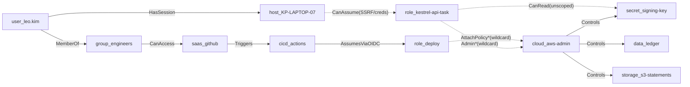

# Identity & Cloud Attack-Path Analysis

Entry point: **user:leo.kim** (phished engineer). Crown jewels: `secret:signing-key`, `cloud:aws-admin`, `data:ledger`.

## Result (computed)
- Attack paths to crown jewels — **current: 7**, **target (least-privilege): 0**
- **Attack paths eliminated: 7**

Example current path to the signing key:

`user:leo.kim -> host:KP-LAPTOP-07 -> role:kestrel-api-task -> cloud:aws-admin -> secret:signing-key`

## What eliminates them
- Scope `kestrel-api-task` to only the secrets/resources it needs (remove wildcard admin).
- SCP guardrail denying `iam:Attach*` / `*:*` on the deploy path.
- IMDSv2 + SSRF allow-list so a compromised laptop/app can't assume the task role.

## Current-state graph (risky edges dashed)

